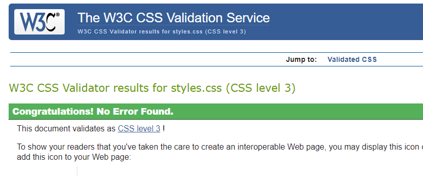

### Student Number - P14154601	
### Module code: CTEC3905
### Deadline: 16th December 2017

### Below is a small description of my website content - 

My website content includes my Journey through my final year. The website has different sections showing the modules which I have completed during my final year of study. The website also includes a link to a article which was produced by DMU on the success from work carried through my placement.

#### Audience - 
The website is targeted for future employers who I will be able to show my success during my final year of university. The website will show the skills set which I have gained, and they will also be able to explore different split sections within the website as well as showing my skill set to build the website. 

#### Purpose of website - 
The website will allow students and potential employers to see how different skills which are gained through the modules which are studied can help with selective jobs. The website promotes the module as it allows students to build a site for future use or more development within the website after the course has finished, as well as understand which modules are beneficial to future job prospects.

#### Alignment - 
The website has been constructed so it connects to give a holistic feel to the website. The benefit has imbedded smooth scroll code which improves the navigation within the website. Link to the website grid - 

#### Repetition - 
Throughout the website I have maintained the consistency of text style as well as colour scheme. 
The benefits of this will allow the website to feel consistent, images implemented with the consideration of mobile first. 

#### Proximity - 
The website is built using a mobile first approach, this will ensure that the website can work all on platforms - mobile, tablet, desktop. Sizes are checked through testing to ensure they work successfully on all 3 platforms. 

#### Contrast - 
Colours like the background colour and front colour have been kept like create a theme which the website would present. Section boxes have helped apply many rules. 

#### Google Translate - 
The website has googled translate so it would allow users from around the world to use it which makes it more accessible. 

#### Google API - 
The website has a google api where the map is included within the website. This is a interactive map that enables users to see where the placement was carried out. 

#### Alignment - 
Alignment within the website is set so all sections within the website can be accessible. This allows the user to understand different sections of the website. 

#### Goal of website - 
Gives users a clear perception of ICT students and what skills can be gained if they do a placement year in industry. As well as understand the different modules that can be picked to help finding graduate jobs. 

#### Responsive navigation bar - 
The navigation bar is very responsive as it works with all platforms, the menu bar will change according to platforms. On desktop it will change to a full bar, on other platforms like tablet and mobile it is set so the menu bar would have to be pressed on for it to appear below. This has been created to save within the website but also fit in with mobile first. 

#### Timeline - 
The animated timeline will appear from the left and right as the user is scrolling down on the website. This makes the website more appealing for the user. The timeline has set up, so it has a listed set of time line text in order of date. 

#### Sitemap - 
The sitemap has been included within the website, this is located at the bottom the website which has been aligned to the left of the website. The sitemap will allow the user to have quick access to sections of the website from the sitemap. 

#### Footer - 
The footer has been included at the bottom of the website, this includes my name as well as links to my social media platforms, so users of the website are able to view my content but also connect with me. 

#### Issues and Resolution 

1- One of the issues which occurred during my development phases was when I checked my website the skills section where the users hoovers over for text to appear was not responsive. I had to make this more responsive, so it would work on all platforms especially mobile first and tablet due to their screen size. 

2- Within the main body of the website I had a problem with the cards of the animation was too big, so this resulted in me going back to these sections to ensure I reduce the size for certain platforms, so they don’t look too big. 

#### User Testing Evidence - 

#### User Testing with a university student - Mobile First - Tablet - Desktop 
#### Device used - Nexus 5X - Resolution - 412 X 732 
#### User Friendly - 
The website is easy to use, as everything within the website is very responsive. 
#### Interface - 
The interface has set colours within the theme, everything matches with the colour scheme and there is no colours present which hurt eyes. 
#### Feedback - 
The website is easy to navigate, the website also has any links like the back to top button at the end of each section which would bring the website to the top of the page. The website has a very useful sitemap which has made it easier for me to access specific parts of the section. 

#### Test No - 1 - 
Is the website responsive? 
#### Description 
Yes, the website is very responsive on all platforms. 
#### Test Result - Pass
#### Test No - 2 - 
Does the social media icons work? 
#### Description 
Yes, the social media icon works on all platforms. 
#### Test Result - Pass
#### Test No - 3 - 
Does the timeline work on all platforms with animations working? 
#### Description 
Yes, the timeline works on all platforms with animations showing from left to right. 
#### Test Result - Pass
#### Test No - 4 - 
Are able to navigate on the google map? 
#### Description 
Yes, the I am able to navigate the google maps within all platforms. 
#### Test Result - Pass
#### Test No - 5 - 
Does "Rakesh's placement journey" enable you to navigate to the article from the picture presented and section title? 
#### Description 
Yes, I am able to perform this action on all platforms. 
#### Test - Pass
#### Test No - 6 - 
Does back to top buttons work? 
#### Description 
Yes, I am able to perform this action on all platforms. 
#### Test - Pass

## Mobile First View - 

## Tablet View - 

## Desktop View - 

## Errors in the website

### Css Errors - 

### Errors present - 

### Errors fixed - 

### Html Errors - 

### Errors present - 

### Errors fixed -  

### Javascript Error - 

### Errors present and fixed - 

## Wireframes 

#### Mobile First

#### Tablet

#### Desktop

#### References - 

Lab Week 02 - Link nav to each heading

Lab Week 04 - Mobile First Responsiveness

Lab week Week 07 - Image Slideshow

https://codepen.io/thalseth/pen/saqIj 

https://www.freeformatter.com/html-formatter.html#ad-output 

https://codepen.io/jm/pen/GlICH?page=1& - Simple animation timeline scroller 

https://webdesign.tutsplus.com/tutorials/building-a-vertical-timeline-with-css-and-a-touch-of-javascript--cms-26528 - Timeline scroller 

https://stackoverflow.com/questions/12243818/adding-google-translate-to-a-web-site

 
